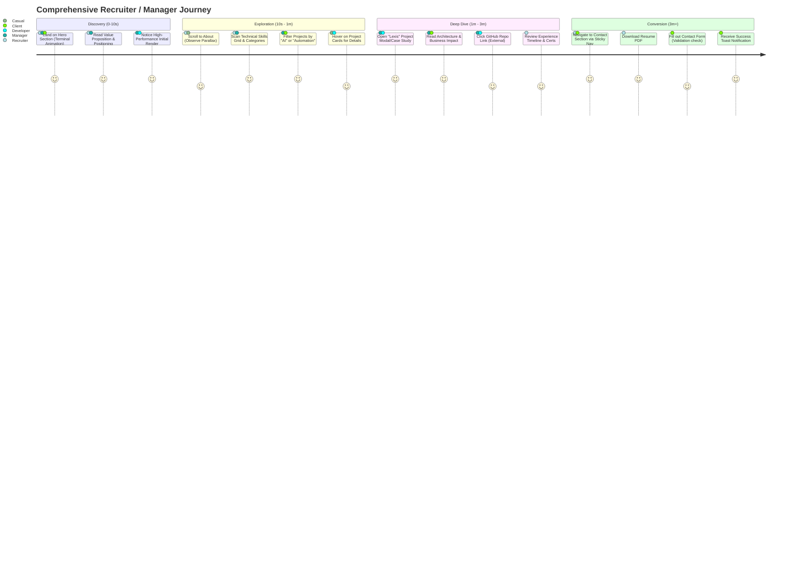
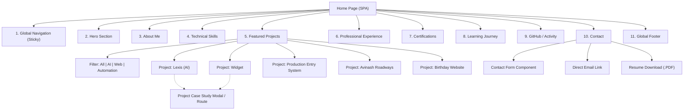

# Comprehensive Product Requirements Document (PRD)
## Abhishek Thakur - Premium Developer Portfolio

---

## 1. Executive Summary
This document serves as the implementation-ready blueprint for the premium personal developer portfolio website of Abhishek Thakur. Positioned as a Software Developer specializing in Web Development, Automation, and AI/LLM Applications, the portfolio must act as a high-fidelity digital presence. It will not just outline skills, but visually and interactively prove technical capabilities, problem-solving depth, and professional progression. The site uses a dark, premium, "developer-first" aesthetic with a highly sophisticated motion system, emphasizing performance, accessibility, and exceptional user experience.

---

## 2. Product Vision
To engineer an immersive, high-performance digital portfolio that transcends traditional static resumes. It must serve as living proof of Abhishek Thakur's engineering capabilities, bridging business automation logic with modern AI and Software engineering. The goal is to compel recruiters, engineering managers, and clients within the first 10 seconds of landing, validating Abhishek as a top-tier candidate and partner.

---

## 3. Problem Statement
Traditional resumes and standard template portfolios fail to capture the dynamic, interactive nature of modern software engineering. They cannot effectively demonstrate UI/UX mastery, complex AI integrations, or the nuances of automation logic. Abhishek requires a bespoke platform that goes beyond static text, providing interactive case studies, high-performance animations, and deep technical context to properly convey his progression from business automation to advanced AI applications.

---

## 4. Goals
- **Conversion:** Convert 15% of relevant visitors (recruiters/managers/clients) into direct contacts, form submissions, or deep-dives into his GitHub repositories.
- **Brand Positioning:** Establish Abhishek as a premium, detail-oriented engineer capable of handling complex UI, AI, and full-stack challenges with finesse.
- **Performance:** Achieve strict 100/100/100/100 scores across all Core Web Vitals and Lighthouse metrics on both mobile and desktop.
- **Accessibility:** Meet and exceed WCAG 2.2 AA standards, ensuring complete keyboard navigability and screen reader compatibility.

---

## 5. Non-Goals
- E-commerce functionality or direct monetization on the platform.
- Maintaining a technical blog or newsletter in the MVP phase.
- Complex backend infrastructure (the site must be statically generated or serverless to minimize operational overhead and costs).
- Arbitrary skill quantification (e.g., "90% React", "4/5 Stars in Python").

---

## 6. Target Users
1. **Recruiters (Technical & Non-Technical):** HR personnel parsing for keywords, assessing professional polish, and looking for immediate contact methods.
2. **Hiring Managers / Engineering Leads:** Technical evaluators assessing code quality, architecture choices, UI/UX implementation, and problem-solving depth.
3. **Clients (B2B/Freelance):** Prospects looking for automation (Zoho/Apps Script) and tailored web development solutions, focusing on business impact.
4. **Developers / Peers:** Peers exploring project repositories, tech stacks, open-source contributions, and drawing inspiration from the portfolio's architecture.
5. **Casual Visitors:** Individuals browsing web design inspiration or exploring the intersection of business automation and AI.

---

## 7. User Personas

| Persona | Name | Role | Primary Goal | Pain Points |
| :--- | :--- | :--- | :--- | :--- |
| **Persona 1** | Sarah | Tech Recruiter | Quickly identify tech stack match, verify years of experience, and contact the candidate. | Wading through cluttered sites, inability to find a clear resume download or email link. |
| **Persona 2** | David | Eng. Manager | Evaluate code quality, system architecture, and AI/LLM practical application experience. | Vague project descriptions lacking technical depth, architecture context, or code links. |
| **Persona 3** | Marcus | SMB Owner | Find a reliable developer to automate business workflows (Zoho/Google Apps Script). | Overly technical jargon; inability to see real-world business ROI in developer portfolios. |
| **Persona 4** | Elena | Junior Dev | Find inspiration for portfolio design, clean UI implementation, and project structuring. | Gatekept source code, minified-only assets, lack of explanation on how things were built. |
| **Persona 5** | Alex | Casual/Peer | Browse high-quality UI/UX designs and discover new libraries or motion techniques. | Janky animations, poor mobile responsiveness, broken scroll behaviors. |

---

## 8. User Stories

### Persona 1: Sarah (Tech Recruiter)
1. As a recruiter, I want a persistent, highly visible "Download Resume" button so I can quickly save his profile to my ATS.
2. As a recruiter, I want to see a scannable, categorized list of technical skills so I can match them against my job requisition.
3. As a recruiter, I want a clear, functioning contact form so I can reach out immediately without opening my email client.
4. As a recruiter, I want to see verifiable certifications (like AWS or Zoho) with external links to validate his credentials.
5. As a recruiter, I want the site to load instantly on my corporate laptop so I don't waste time waiting.
6. As a recruiter, I want to read a concise "About" section to understand his professional journey and soft skills quickly.

### Persona 2: David (Engineering Manager)
7. As an engineering manager, I want to click on a project card and read a detailed case study so I can understand the problem, architecture, and solution.
8. As an engineering manager, I want direct links to live demos and public GitHub repositories for every major project.
9. As an engineering manager, I want to see a timeline of his experience to gauge his career progression and tenure.
10. As an engineering manager, I want to view his current learning journey to verify he stays up-to-date with emerging tech (e.g., new LLM frameworks).
11. As an engineering manager, I want to inspect the portfolio's source code and network tab to ensure he follows modern web performance best practices.
12. As an engineering manager, I want to see clear visual distinctions between frontend, backend, and AI projects.

### Persona 3: Marcus (SMB Owner / Client)
13. As a client, I want to filter the featured projects to only show "Automation" or "Business Tools".
14. As a client, I want to read the specific business outcomes of projects (e.g., "Saved 20 hours a week", "Increased conversion") rather than just the tech stack.
15. As a client, I want to see professional branding and high-quality UI so I feel confident in his ability to deliver premium work.
16. As a client, I want to use a contact form that allows me to specify I am looking for "Freelance/Contract Work".
17. As a client, I want to view the site on my mobile phone while commuting and have a perfect experience.
18. As a client, I want to understand what "Zoho CRM" and "Deluge" automation actually means through clear case studies.

### Persona 4: Elena (Junior Developer)
19. As a junior developer, I want to see a dedicated "Tech Stack" overlay for the portfolio itself to learn how it was built.
20. As a junior developer, I want to explore his GitHub activity feed to see what open-source projects he contributes to.
21. As a junior developer, I want to read his engineering journey to understand how he transitioned from automation to AI.
22. As a junior developer, I want to experience smooth, non-janky scroll animations to learn what good motion design looks like.
23. As a junior developer, I want to use keyboard navigation flawlessly to study accessibility best practices.

### Persona 5: Alex (Casual Visitor / Designer)
24. As a casual visitor, I want an immediate "wow" factor upon landing via the animated terminal hero section.
25. As a casual visitor, I want to be able to toggle reduced motion if the animations make me dizzy.
26. As a casual visitor, I want to interact with project cards (hover effects, 3D tilts) to experience micro-interactions.
27. As a casual visitor, I want a clear visual hierarchy so my eyes are naturally guided down the page.
28. As a casual visitor, I want custom scrollbars and text selection colors that match the premium dark theme.

---

## 9. User Journey (Mermaid)

---

## 10. Information Architecture (Mermaid)

---

## 11. Detailed Feature Specifications

### F-NAV-001: Global Sticky Navigation
- **Description:** A floating, glassmorphic navigation bar that tracks scroll position and highlights the active section.
- **User Value:** Prevents users from getting lost in a long single-page application.
- **Priority:** P0
- **User Story:** As a user, I want to jump instantly to the "Projects" or "Contact" section from anywhere on the page.
- **Functional Requirements:**
  - Must become a blurred, glassmorphic pill shape upon scrolling past `y=50`.
  - Must highlight active section based on `IntersectionObserver`.
  - Must collapse into an animated hamburger menu on viewports < 1024px.
  - Must close mobile menu automatically upon clicking a link.
- **Acceptance Criteria:**
  - Navigation accurately highlights sections when at least 50% of the section is in the viewport.
  - Keyboard navigation (Tab) successfully moves through all links in the DOM order.
  - Mobile menu opens/closes with a smooth transform animation (< 300ms).

### F-HERO-001: Hero Layout & Typography
- **Description:** The primary above-the-fold landing experience containing Name, Titles, Positioning, and CTAs.
- **User Value:** Establishes instant credibility and clearly defines Abhishek's capabilities.
- **Priority:** P0
- **User Story:** As a recruiter, I want to immediately know who Abhishek is, what he does, and how to contact him or view his work.
- **Functional Requirements:**
  - H1 Tag: "Abhishek Thakur".
  - H2/Subheadline: "Software Developer | Web Development | Automation | AI/LLM Applications".
  - Two Primary CTAs: "View Projects" (Scroll anchor) and "Download Resume" (PDF link).
- **Acceptance Criteria:**
  - Content fits entirely within 100vh on desktop and mobile without scrolling.
  - H1 typography scales fluidly between mobile (2.5rem) and desktop (5rem).

### F-HERO-002: Interactive Terminal Visual
- **Description:** A decorative, animated code terminal simulating an initialization script.
- **User Value:** Visually proves developer identity and adds a premium interactive element.
- **Priority:** P1
- **User Story:** As a casual visitor, I want to see a cool, tech-focused visual that confirms I am on a premium developer's site.
- **Functional Requirements:**
  - Container mimicking a MacOS/Linux terminal window (3 dots in corner).
  - Typewriter effect rendering fake initialization logs (e.g., `Loading core_modules... [OK]`).
  - Must pause animation if `prefers-reduced-motion` is enabled.
- **Acceptance Criteria:**
  - Terminal types out 5-7 lines over 3 seconds.
  - Has an ARIA label indicating it is a decorative animation.

### F-HERO-003: Ambient Background Animation
- **Description:** A highly subtle, canvas-based or CSS-based ambient background (e.g., slow-moving particles, glowing gradient orbs).
- **User Value:** Enhances the "premium dark aesthetic" without distracting from content.
- **Priority:** P2
- **User Story:** As a visitor, I want to feel a sense of depth and modernity.
- **Functional Requirements:**
  - Must run at 60fps with zero layout thrashing.
  - Opacity must not exceed 10%.
  - Must completely unmount/disable on mobile devices or if low battery/reduced motion is detected.
- **Acceptance Criteria:**
  - Performance audit shows no main-thread blocking from the background.

### F-ABOUT-001: About Section
- **Description:** A concise narrative detailing Abhishek's journey from business automation to AI/Software engineering.
- **User Value:** Provides human context and highlights soft skills/adaptability.
- **Priority:** P1
- **User Story:** As a manager, I want to read his story to understand his motivation and career trajectory.
- **Functional Requirements:**
  - Max 3 paragraphs.
  - Include a stylized portrait image with a subtle hover glow.
  - Image must be heavily optimized (WebP/AVIF).
- **Acceptance Criteria:**
  - Text maintains WCAG AA contrast ratio.
  - Image lazy-loads with a skeleton placeholder.

### F-SKIL-001: Categorized Skills Display
- **Description:** Grid layout of technical skills organized by domain (Frontend, Backend, Automation, AI, Tools).
- **User Value:** Allows fast scanning for keyword matching by recruiters and managers.
- **Priority:** P0
- **User Story:** As a recruiter, I want a clean list of technologies categorized logically.
- **Functional Requirements:**
  - 5 distinct categories displayed as cards or masonry grids.
  - Each skill is a visual "badge/tag" with an optional SVG icon.
  - NO percentage bars or arbitrary skill levels.
- **Acceptance Criteria:**
  - Tags wrap gracefully on smaller viewports.
  - Hovering over a category card subtly elevates it.

### F-PROJ-001: Project Cards Grid
- **Description:** Responsive grid (1 col mobile, 2 col tablet, 3 col desktop) of featured projects.
- **User Value:** Provides entry points to detailed case studies.
- **Priority:** P0
- **User Story:** As a user, I want to see a summary of his best work at a glance.
- **Functional Requirements:**
  - Cards contain: Thumbnail image, Title, 1-sentence summary, 3 tech tags.
  - Interactive hover state (lift, border glow, image slight zoom).
  - Explicit links for "Live Demo" and "GitHub" if applicable.
- **Acceptance Criteria:**
  - Entire card is clickable (routes to F-PROJ-003), but external links within card intercept the click to prevent double navigation.

### F-PROJ-002: Project Filtering
- **Description:** Segmented control to filter the project grid (e.g., All, Web Dev, Automation, AI).
- **User Value:** Helps clients or managers find exactly the type of work they are interested in.
- **Priority:** P1
- **User Story:** As a client needing Zoho CRM work, I only want to see automation projects.
- **Functional Requirements:**
  - Filter buttons above the grid.
  - FLIP animation (or similar Layout animation via Framer Motion) when grid re-arranges.
- **Acceptance Criteria:**
  - Clicking a filter smoothly animates the exiting/entering cards without jarring layout shifts.

### F-PROJ-003: Project Detail / Case Study Modal
- **Description:** A highly detailed overlay or dynamic page expansion explaining a project in depth.
- **User Value:** Explains the "Why" and "How" to engineering managers.
- **Priority:** P0
- **User Story:** As an engineering manager, I want to read the architecture decisions behind Lexis.
- **Functional Requirements:**
  - Sections: Overview, Problem Statement, Architecture/Tech Stack, Final Outcome/Business Impact.
  - Supports image carousels or larger architectural diagrams.
  - Locks body scroll behind modal.
  - Accessible via direct URL query param (e.g., `?project=lexis`).
- **Acceptance Criteria:**
  - Pressing `Escape` closes the modal. Focus returns to the triggering card.

### F-EXP-001: Experience Timeline
- **Description:** Vertical timeline illustrating professional roles and tenure.
- **User Value:** Validates years of experience and career progression.
- **Priority:** P1
- **User Story:** As a recruiter, I want to see his employment history chronologically.
- **Functional Requirements:**
  - Left border line with glowing nodes for each role.
  - Include Role Title, Company/Client, Date Range, and 2-3 bullet points.
- **Acceptance Criteria:**
  - Timeline nodes light up as they enter the viewport during scrolling.

### F-CERT-001: Certifications Section
- **Description:** Grid or list of professional certificates.
- **User Value:** Provides verified proof of knowledge (e.g., AWS, Zoho).
- **Priority:** P1
- **User Story:** As a recruiter, I want to verify his credentials via official third-party links.
- **Functional Requirements:**
  - Must include: Name, Issuing Org, Date, Credential ID, and an external "Verify" link.
- **Acceptance Criteria:**
  - Verify links open in a new tab (`target="_blank" rel="noopener noreferrer"`).

### F-LEARN-001: Engineering Learning Journey
- **Description:** A dedicated section highlighting current books, courses, or tech being learned.
- **User Value:** Shows continuous improvement and passion for engineering.
- **Priority:** P2
- **User Story:** As a manager, I want to know what he is studying right now.
- **Functional Requirements:**
  - Small, styled cards showing "Currently Learning: [Topic/Book]".
- **Acceptance Criteria:**
  - Renders correctly across breakpoints.

### F-GH-001: GitHub Activity Integration
- **Description:** A visual representation of recent GitHub activity (commit graph or recent repos).
- **User Value:** Proves daily coding habits and open-source involvement.
- **Priority:** P2
- **User Story:** As a peer, I want to see how active he is on GitHub.
- **Functional Requirements:**
  - Fetch static JSON (or edge function) of recent commits/stars.
  - Fallback state if API rate limit is exceeded.
- **Acceptance Criteria:**
  - If API fails, UI degrades gracefully without showing an error to the user (e.g., shows a static "View my GitHub" banner instead).

### F-CONT-001: Secure Contact Form
- **Description:** Form for users to send messages directly to Abhishek's email.
- **User Value:** Highest conversion action for clients/recruiters.
- **Priority:** P0
- **User Story:** As a client, I want to fill out a secure form to request a quote.
- **Functional Requirements:**
  - Fields: Name, Email, Subject (Dropdown: Hiring, Freelance, General), Message.
  - Client-side validation (regex for email, min length for message).
  - Server-side validation via serverless function.
  - Spam protection: Honeypot field AND Cloudflare Turnstile / reCAPTCHA v3.
- **Acceptance Criteria:**
  - Form cannot be submitted with empty required fields.
  - Success toast appears upon 200 OK response.
  - Form resets after successful submission.

### F-CONT-002: Resume Download
- **Description:** Direct link to download a PDF resume.
- **User Value:** Essential for ATS systems and offline review.
- **Priority:** P0
- **Functional Requirements:**
  - Available in Hero, sticky Nav (on desktop), and Contact section.
  - File hosted on CDN for fast download.
- **Acceptance Criteria:**
  - Triggers a direct download or opens PDF in new tab.

### F-FOOT-001: Global Footer
- **Description:** Standard footer with copyright, social links, and built-with credits.
- **User Value:** Anchors the page and provides alternative navigation.
- **Priority:** P1
- **Functional Requirements:**
  - Links to LinkedIn, GitHub, X (Twitter), Email.
  - "Designed & Built by Abhishek Thakur".
- **Acceptance Criteria:**
  - Sticks to the bottom of the content gracefully.

### F-ANIM-001: Motion System
- **Description:** The underlying physics and rules for all animations on the site.
- **User Value:** Makes the site feel premium and alive.
- **Priority:** P0
- **Functional Requirements:**
  - (Detailed extensively in Section 14).
- **Acceptance Criteria:**
  - No animation causes CLS (Cumulative Layout Shift).

### F-RESP-001: Responsive Layout Management
- **Description:** Ensuring perfect UI across 4 distinct breakpoints.
- **User Value:** 50%+ of users will view on mobile/tablet.
- **Priority:** P0
- **Acceptance Criteria:**
  - Passes Google Mobile-Friendly test.

### F-A11Y-001: Accessibility Standards
- **Description:** Ensuring the site is usable by everyone, regardless of ability.
- **User Value:** Professionalism, SEO benefits, and inclusive design.
- **Priority:** P0
- **Acceptance Criteria:**
  - 100/100 Accessibility score in Lighthouse. Tab navigation works perfectly.

---

## 12. Comprehensive Design System

### 12.1 Color Palette (Hex & RGBA)
| Token | Role | Hex Value | RGBA Equivalent |
| :--- | :--- | :--- | :--- |
| `color-bg-base` | Deepest background | `#050505` | `rgba(5, 5, 5, 1)` |
| `color-bg-surface1`| Default cards/panels | `#121212` | `rgba(18, 18, 18, 1)` |
| `color-bg-surface2`| Hovered cards/inputs | `#1E1E1E` | `rgba(30, 30, 30, 1)` |
| `color-bg-glass` | Navbars/Modals | `#12121299` | `rgba(18, 18, 18, 0.6)` |
| `color-text-primary`| Headings, primary body| `#F3F4F6` | `rgba(243, 244, 246, 1)` |
| `color-text-second` | Subheadings, dates | `#9CA3AF` | `rgba(156, 163, 175, 1)` |
| `color-text-muted` | Captions, placeholders| `#6B7280` | `rgba(107, 114, 128, 1)` |
| `color-accent-blue` | Primary brand/tech CTA| `#3B82F6` | `rgba(59, 130, 246, 1)` |
| `color-accent-blue-hover` | Hover state for blue| `#2563EB` | `rgba(37, 99, 235, 1)` |
| `color-accent-purple`| Secondary/AI brand | `#8B5CF6` | `rgba(139, 92, 246, 1)` |
| `color-border-subtle`| Card outlines, dividers| `#27272A` | `rgba(39, 39, 42, 1)` |
| `color-border-focus`| Keyboard focus ring | `#60A5FA` | `rgba(96, 165, 250, 1)` |
| `color-status-success`| Form success toast | `#10B981` | `rgba(16, 185, 129, 1)` |
| `color-status-error`| Form validation error | `#EF4444` | `rgba(239, 68, 68, 1)` |

### 12.2 Typography Scale
Primary Sans-serif: `Inter` or `Geist`. Technical Monospace: `JetBrains Mono` or `Fira Code`.
Base size: `16px` (1rem).

| Token | Element | Font Size (rem/px) | Line Height | Weight | Letter Spacing |
| :--- | :--- | :--- | :--- | :--- | :--- |
| `text-h1` | Hero Title | `4.0rem` / `64px` | `1.1` | 700 / Bold | `-0.02em` |
| `text-h2` | Section Titles | `2.5rem` / `40px` | `1.2` | 600 / Semi | `-0.01em` |
| `text-h3` | Project/Card Titles| `1.5rem` / `24px` | `1.3` | 600 / Semi | `0` |
| `text-h4` | Subsections | `1.25rem` / `20px` | `1.4` | 500 / Med | `0` |
| `text-body-l` | Intro Paragraphs | `1.125rem`/ `18px` | `1.6` | 400 / Reg | `0` |
| `text-body-m` | Default Body | `1.0rem` / `16px` | `1.6` | 400 / Reg | `0` |
| `text-body-s` | Meta data, tags | `0.875rem`/ `14px` | `1.5` | 400 / Reg | `0` |
| `text-mono` | Terminal, code, nums| `0.875rem`/ `14px` | `1.5` | 400 / Reg | `0` |

### 12.3 Spacing Scale (4px baseline)
| Token | Rem | Px | Usage Example |
| :--- | :--- | :--- | :--- |
| `space-1` | `0.25rem`| `4px` | Between icon and text |
| `space-2` | `0.5rem` | `8px` | Inside badges/tags |
| `space-3` | `0.75rem`| `12px` | Card internal padding (small) |
| `space-4` | `1.0rem` | `16px` | Default gap, button padding |
| `space-6` | `1.5rem` | `24px` | Card internal padding (standard)|
| `space-8` | `2.0rem` | `32px` | Spacing between paragraphs |
| `space-12`| `3.0rem` | `48px` | Spacing between intra-section components |
| `space-24`| `6.0rem` | `96px` | Vertical spacing between sections (Mobile) |
| `space-32`| `8.0rem` | `128px`| Vertical spacing between sections (Desktop) |

### 12.4 Grid System
- Max Container Width: `1200px` (centered).
- Margins (Mobile): `16px`, Margins (Tablet/Desktop): `32px`.
- Columns: 12 (Desktop), 8 (Tablet), 4 (Mobile).
- Gutter: `24px`.

### 12.5 Border Radius & Shadows & Glows
| Token | Value | Usage |
| :--- | :--- | :--- |
| `radius-sm` | `4px` | Tags, checkboxes, tooltips |
| `radius-md` | `8px` | Buttons, inputs, small cards |
| `radius-lg` | `16px` | Featured project cards, modals |
| `radius-pill`| `9999px`| Floating nav, rounded badges |
| `shadow-sm` | `0 1px 2px 0 rgba(0,0,0,0.4)` | Buttons |
| `shadow-md` | `0 4px 6px -1px rgba(0,0,0,0.6)`| Cards default state |
| `shadow-lg` | `0 10px 15px -3px rgba(0,0,0,0.8)`| Hovered cards, Modals |
| `glow-blue` | `0 0 20px rgba(59,130,246,0.15)`| Primary button hover, active card border |
| `glow-purple`| `0 0 20px rgba(139,92,246,0.15)`| AI tag hover, secondary accents |

### 12.6 Component Variants
- **Card - Default:** `bg-surface1`, `border-subtle`, `radius-lg`, `shadow-md`.
- **Card - Glass:** `bg-glass`, `backdrop-blur-md` (12px), `border-subtle`, `radius-lg`.
- **Button - Primary:** `bg-accent-blue`, `text-primary`, `radius-md`, hover transitions to `bg-accent-blue-hover` with `glow-blue`.
- **Button - Secondary/Ghost:** Transparent bg, `border-subtle`, `text-second`, hover transitions to `bg-surface2` and `text-primary`.
- **Input Field:** `bg-surface1`, `border-subtle`, `radius-md`, `text-primary`. Focus state: border turns `color-border-focus`, adds `glow-blue`, removes default browser outline.
- **Badges/Tags:** `bg-surface2`, `text-second`, `text-mono`, `radius-sm`, `space-2` padding.

---

## 13. Animation Requirements

### 13.1 Animation Tokens Table
| Token | Duration (ms) | Easing Function (Cubic-Bezier) | Description |
| :--- | :--- | :--- | :--- |
| `anim-fast` | 150ms | `cubic-bezier(0.4, 0, 0.2, 1)` | Hover states, color shifts, button presses |
| `anim-normal`| 300ms | `cubic-bezier(0.16, 1, 0.3, 1)` | Modals opening, mobile menu toggle |
| `anim-slow` | 600ms | `cubic-bezier(0.16, 1, 0.3, 1)` | Scroll reveal translations (fade in up) |
| `anim-bg` | Infinite | Linear | Ambient background particles/glow rotation |

### 13.2 Scroll Animation Specifications (Intersection Observer)
- **Trigger:** Element hits 15% from the bottom of the viewport (`threshold: 0.15`).
- **Action:** Element goes from `opacity: 0`, `transform: translateY(20px)` to `opacity: 1`, `transform: translateY(0)`.
- **Staggering:** Sibling elements (like a grid of skills or project cards) must stagger their entrance by `100ms` per item to create a cascading reveal effect.

### 13.3 Interactive Specifications
- **Project Card Hover:**
  - Card translates Y by `-4px` (`anim-fast`).
  - Shadow increases to `shadow-lg`.
  - 1px border gradient (Spotlight effect) tracks mouse `(x, y)` position via JS injecting CSS variables.
- **Button Hover:** Scale to `1.02`, glow opacity increases by `10%`. Active/Pressed: Scale to `0.98`.

### 13.4 Page Load Timeline (ms-by-ms)
- **0ms:** DOMContentLoaded. Background color `#050505` paints immediately.
- **100ms:** Sticky Nav fades in down from top (`transform: translateY(-100%)`).
- **200ms:** Hero Subheadline and Name fade in up.
- **400ms:** Hero Terminal begins typing animation.
- **800ms:** Hero CTAs fade in.
- **1500ms:** Terminal animation completes; ambient background subtly fades in (`anim-slow`).

### 13.5 Reduced Motion Behavior
- If `window.matchMedia('(prefers-reduced-motion: reduce)').matches` is true:
  - All `translateY` scroll reveals are disabled. Elements just change `opacity` over `150ms`.
  - Stagger delays are set to `0ms`.
  - Terminal typing animation completes instantly.
  - Ambient background is completely hidden or frozen.

---

## 14. Responsive Requirements (Component Matrix)

| Component | Mobile (<768px) | Tablet (768px - 1023px) | Laptop (1024px - 1439px) | Desktop (1440px+) |
| :--- | :--- | :--- | :--- | :--- |
| **Navigation** | Hamburger menu, full-screen glass overlay. | Hamburger menu. | Inline sticky pill nav. | Inline sticky pill nav. |
| **Hero Layout**| Stacked vertically. Typography scaled down. | Stacked. Medium typography. | Side-by-side (Text Left, Terminal Right). | Side-by-side, max-width constrained. |
| **Skills Grid**| 2 columns (tags). Horizontal scroll for overflow. | 3 columns. | 5 column masonry/grid. | 5 column masonry/grid. |
| **Projects** | 1 column. Tap to reveal details. | 2 columns. Hover enabled. | 3 columns. Complex hover fx. | 3 columns. Complex hover fx. |
| **Timeline** | Line pushed to left edge. Nodes overlap. | Centered line. Alternating L/R. | Centered line. Alternating L/R. | Centered line. Alternating L/R. |
| **Contact Form**| 1 column (Name above Email). | 2 columns for Name/Email. | 2 columns for Name/Email. | 2 columns for Name/Email. |
| **Footer** | Stacked links, center aligned. | Row layout, space-between. | Row layout, space-between. | Row layout, space-between. |
| **Animations** | No complex hover fx. Simplified reveals. | Normal reveals. | Full spotlight/mouse-track fx. | Full spotlight/mouse-track fx. |

---

## 15. Content Requirements

- **Hero Copy:** Must strictly read "Software Developer | Web Development | Automation | AI/LLM Applications". No generic "Hi, I build things for the web" filler.
- **About Section:**
  - Paragraph 1: Background in bridging business operations with software (mention Zoho/automation).
  - Paragraph 2: Transition/focus on modern Web UI (React/Vite) and backend logic.
  - Paragraph 3: Current trajectory into AI (LangChain, LLMs) and passion for engineering.
- **Skills Content:**
  - Frontend: React, JavaScript, HTML, CSS, Vite, Tailwind.
  - Backend: Python, REST APIs, Node.js.
  - Automation: Zoho CRM, Zoho Books, Deluge, Google Apps Script.
  - AI: LLMs, LangChain, NLP concepts, OpenAI API.
  - Tools: Git, GitHub, Firebase, Vercel/Netlify.
- **Project Descriptions (Mandatory Content per Project):**
  - **Lexis:** Highlight "AI/Desktop Assistant", LangChain usage, NLP processing.
  - **Widget:** Highlight "Zoho CRM automation", Deluge, business hours saved.
  - **Production Entry System:** Highlight React UI + Google Apps Script backend.
  - **Avinash Roadways:** Highlight Vite/React performance, SEO, corporate branding.
  - **Birthday Website:** Highlight advanced CSS, interactive frontend, animations.

---

## 16. Accessibility Requirements (A11Y)

- **Semantic HTML:** Strict adherence to landmarks (`<header>`, `<nav>`, `<main>`, `<section>`, `<footer>`). Use `<article>` for project cards.
- **Keyboard Navigation Map:**
  1. Skip to Content link (hidden until focused).
  2. Nav links.
  3. Hero CTAs.
  4. Filter Buttons.
  5. Project Cards (Enter key opens modal).
  6. Modal internal links (Trap focus inside modal when open).
  7. Form inputs.
  8. Footer links.
- **Focus Management:** Custom focus ring: `outline: 2px solid #60A5FA; outline-offset: 4px;`.
- **ARIA Guidelines:**
  - `aria-hidden="true"` on purely decorative SVGs/icons.
  - `aria-expanded` and `aria-controls` on the mobile hamburger menu.
  - `aria-live="polite"` for form submission success/error messages.
- **Color Contrast:** Validate all gray text (`#9CA3AF`) against base backgrounds (`#050505`) to ensure > 4.5:1 ratio (AA).
- **Forms:** All `<input>` and `<textarea>` must have explicitly associated `<label>` tags (not just placeholders).

---

## 17. SEO Requirements

- **Meta Tags:**
  - Title: `Abhishek Thakur | Software Developer & AI Engineer`
  - Description: `Portfolio of Abhishek Thakur. Software Developer specializing in React, Python, Business Automation (Zoho), and AI/LLM applications.`
- **OpenGraph & Twitter Cards:**
  - `og:image` and `twitter:image`: 1200x630px highly polished screenshot of the Hero section.
  - `twitter:card`: `summary_large_image`.
- **Structured Data (JSON-LD):** Implemented in `<head>` as `"@type": "Person"`, including name, jobTitle, url, sameAs (LinkedIn, GitHub).
- **Sitemap & Robots.txt:** Auto-generated `sitemap.xml` mapping the index. `robots.txt` allowing all standard crawlers.
- **Favicons:** 16x16, 32x32, 180x180 (Apple Touch Icon), and `site.webmanifest` required.

---

## 18. Performance Requirements

- **Core Web Vitals Targets:**
  - Largest Contentful Paint (LCP): < 1.2s.
  - First Input Delay (FID): < 100ms.
  - Cumulative Layout Shift (CLS): 0.00.
  - Time to Interactive (TTI): < 2.0s.
- **Budgets:**
  - JavaScript Bundle Size: < 150KB (gzip) for initial load.
  - Total Image Weight: < 800KB per page view.
- **Image Strategy:** All project thumbnails must be WebP/AVIF format, sized at 2x resolution (for Retina), and use `loading="lazy"` (except Hero).
- **Font Strategy:** Self-host fonts if possible, or use `preconnect` to Google Fonts with `font-display: swap` to prevent FOIT (Flash of Invisible Text).
- **Lighthouse:** Hard requirement of 100/100/100/100 across desktop and mobile runs.

---

## 19. Analytics Requirements

| Event Name | Trigger | Data Captured | Priority |
| :--- | :--- | :--- | :--- |
| `page_view` | Initial load / route change | URL, Referrer, Device | P0 |
| `resume_download` | Click on Resume CTA | Location (Hero vs Nav) | P0 |
| `project_view` | Click on Project Card | Project Name (`Lexis`, etc.) | P0 |
| `github_outbound` | Click on any GitHub link | Target Repo URL | P1 |
| `social_outbound` | Click on LinkedIn/X link | Platform Name | P1 |
| `filter_used` | Click on Project Filter | Filter Category | P2 |
| `form_submit` | Successful contact form | Subject Type (e.g., Hiring) | P0 |
| `form_error` | Failed form validation | Error Type | P1 |

---

## 20. Error, Empty, and Loading States

- **Loading State (Projects/GitHub Data):** If fetching asynchronously, display a dark skeleton layout matching the card geometry, shimmering with a subtle linear gradient from left to right.
- **Empty State (Project Filters):** If a user clicks a filter returning 0 projects, display a centered graphic (e.g., an empty folder SVG) with text: "No projects found in this category" and a "Clear Filters" CTA button.
- **Error State (Form Submit):** Inline red text (`#EF4444`) below the specific failing input field (e.g., "Please enter a valid email address"). Shake animation (CSS keyframes) on the input field for 300ms.
- **Error State (GitHub API Rate Limit):** Graceful fallback. Do not show red errors. Simply hide the live feed and render a static "Check out my repositories on GitHub ->" card.

---

## 21. Security & Privacy Considerations

- **XSS (Cross-Site Scripting):** All user input in the contact form must be sanitized. If using a CMS later, all markdown/HTML injected into React must be sanitized (e.g., using DOMPurify).
- **CSRF & Form Spam:** Use Cloudflare Turnstile (invisible) on the Contact form. Implement server-side rate limiting (e.g., max 5 submissions per IP per hour) on the serverless function handler.
- **API Key Management:** No private API keys (e.g., Email service provider keys, GitHub PATs) may be exposed in the client-side bundle. They must be stored in secure Environment Variables and accessed ONLY via serverless backend functions.
- **CSP (Content Security Policy):** Enforce strict CSP headers restricting `script-src` and `connect-src` to known domains (self, analytics provider, form handler).

---

## 22. MVP vs Phase 2 vs Phase 3 Strategy

### Phase 1 (MVP - Launch)
- Static, hardcoded project data (JSON/TS files).
- Hero section, About, Skills grid, 5 Featured Projects, Static Experience Timeline, basic Contact Form.
- Fully responsive, accessible, perfect Lighthouse scores.
- Standard CSS/Framer Motion scroll animations.

### Phase 2 (Enhancement)
- Real-time GitHub contribution graph integration.
- Certifications section with live verification links.
- "Learning Journey" dynamic cards.
- Project detail modals upgraded with extensive architecture diagrams and carousels.
- Spotlight mouse-tracking hover effects introduced.

### Phase 3 (Advanced/Experimental)
- "Lexis Lite" embedded: A small chat widget trained on Abhishek's resume (RAG pipeline) allowing recruiters to ask questions ("Does Abhishek know Python?").
- Full CMS integration (Sanity or Decap) so Abhishek can update projects without touching code.
- Advanced WebGL/Three.js subtle background environments replacing CSS particles.

---

## 23. Critical Design Review & Technical Mitigations

1. **UX Risk: Overly complex navigation resulting in disorientation.**
   - *Technical Mitigation:* Keep the architecture strictly as a Single Page Application (SPA). Implement a sticky glassmorphic navigation header with an Intersection Observer that constantly updates the "active" state indicator.

2. **Animation Risk: Scroll-jacking or janky performance on low-end mobile devices.**
   - *Technical Mitigation:* Strictly avoid manipulating the native scrollbar (no scroll-jacking). Use the CSS `will-change: transform, opacity` hint sparingly. Map `prefers-reduced-motion` to a global context that disables JS-driven animations entirely, falling back to CSS opacity transitions.

3. **Performance Risk: High-res images for 5+ projects destroying initial load (LCP).**
   - *Technical Mitigation:* Next.js `<Image>` component or custom Vite asset pipeline to force WebP/AVIF generation. Strict `loading="lazy"` on all images except the Hero portrait. Size attributes explicitly defined to prevent CLS.

4. **Accessibility Risk: Dark mode text failing WCAG contrast checks.**
   - *Technical Mitigation:* Enforce a strict palette constraint. `color-text-second` (`#9CA3AF`) on `color-bg-base` (`#050505`) yields a 7.2:1 contrast ratio, comfortably passing WCAG AAA. Automated axe-core testing in CI/CD pipeline.

5. **Mobile Usability Risk: Hover-centric data discovery fails on touchscreens.**
   - *Technical Mitigation:* UI components cannot hide critical data (like Project Title or Tech Stack) behind a hover state. Mobile layouts must display this data persistently. Hover effects (glows, lifts) are purely decorative enhancements restricted via `@media (hover: hover)`.

6. **SEO Risk: Client-side rendered (CSR) React apps struggling with fast indexing.**
   - *Technical Mitigation:* Build using a Static Site Generator (SSG) approach (Next.js App Router static export, Astro, or Vite-SSG). The final output must be raw HTML/CSS served from an Edge CDN (Vercel/Netlify), ensuring Googlebot sees full content instantly.

7. **Security Risk: Bot abuse on the public contact form.**
   - *Technical Mitigation:* Implement a dual-layer defense. A visually hidden "honeypot" input field (bots fill it, humans don't = reject submission), coupled with Cloudflare Turnstile (privacy-first invisible captcha). Backend serverless function strictly validates payloads.

8. **Overengineering Risk: Building a full backend DB for a portfolio that changes quarterly.**
   - *Technical Mitigation:* Use local Markdown/MDX files or typed JSON arrays to store project and experience data. This provides the structure of a DB without the latency, cost, and maintenance of hosting a Postgres/Mongo instance.

9. **Features to Remove (Post-Review):**
   - *Skill Percentage Bars:* Removed immediately. They are scientifically meaningless and often negatively viewed by senior engineering managers. Replaced with categorical listing and project evidence.
   - *Heavy 3D Models in Hero:* Removed for MVP to protect the strict < 1.2s LCP budget.

10. **Features to Postpone:**
    - *AI Chatbot Assistant:* Postponed to Phase 3. Hallucination risks are too high for a first impression. Must be rigorously prompt-engineered and tested before facing recruiters.
