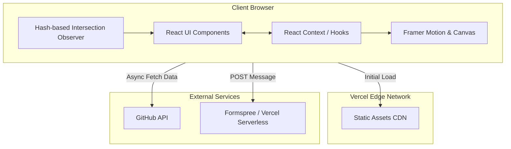
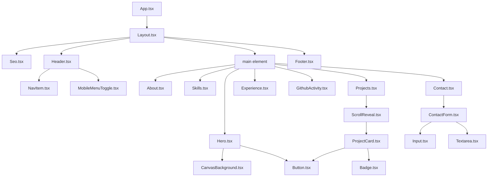
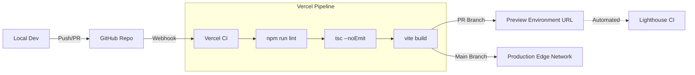

# Technical Requirements Document (TRD)
## Premium Personal Developer Portfolio Website - Abhishek Thakur

### Document Information
- **Owner:** Abhishek Thakur
- **Positioning:** Software Developer | Web Development | Automation | AI/LLM Applications
- **Version:** 2.0.0
- **Status:** Approved for Implementation

---

## 1. Technical Overview
The proposed application is a premium, highly interactive single-page application (SPA) portfolio website built with modern web technologies. The site emphasizes high performance, responsive design, accessibility, and a premium developer aesthetic through sophisticated, performant animations and a meticulously crafted dark mode design system. The architecture relies on client-side rendering with robust static asset optimization, minimizing server costs while maximizing execution speed and security.

## 2. Technology Stack & Decision Matrix

| Category | Recommended | Alternatives Considered | Justification & Trade-offs |
|---|---|---|---|
| **Core Framework** | **React 18.x** | Vue, Svelte | Unparalleled ecosystem, component reusability, and developer familiarity. While Svelte offers smaller bundles, React's Framer Motion integration is vastly superior for complex sequence animations. |
| **Meta-Framework / Bundler** | **Vite 5.x** | Next.js, Astro | **Next.js:** Overkill for a mostly static portfolio without dynamic user data; SSR overhead is unnecessary. **Astro:** Great for static, but SPA transitions and persistent background canvas states are harder to manage. **Vite:** Offers the fastest dev experience, HMR, and perfectly optimized SPA builds. |
| **Language** | **TypeScript 5.x** | JavaScript | Strict type safety prevents runtime errors, self-documents the data model, and provides superior DX (autocomplete, refactoring). Mandatory for premium, maintainable projects. |
| **Styling** | **Tailwind CSS 3.x** | CSS Modules, Styled Components | **Styled Components:** Runtime overhead. **CSS Modules:** Harder to enforce a strict token-based design system globally. **Tailwind:** Rapid styling, zero runtime overhead, built-in design tokens, automatic dead-code elimination. |
| **Animation Core** | **Framer Motion 11.x** | GSAP, CSS Animations | **GSAP:** Powerful but heavy and imperative; overkill unless building a deeply complex timeline. **CSS:** Not flexible enough for complex staggered entrance sequences or orchestrating React component unmounts. **Framer Motion:** Declarative, React-native, handles unmounts (`AnimatePresence`), excellent developer experience. |
| **Background Rendering** | **Canvas 2D API** | WebGL (Three.js), CSS DOM nodes | **WebGL:** Too heavy for a simple particle background, wastes battery on mobile. **CSS/DOM:** 100+ moving particles in the DOM causes severe main-thread jank. **Canvas 2D:** Perfect balance of performance (60fps easily) and low bundle footprint. |
| **Icons** | **Lucide React** | FontAwesome, HeroIcons | Clean, consistent 24x24 grid SVG icons. Tree-shakeable, low bundle size. |
| **Forms** | **React Hook Form 7.x** | Formik, native forms | Performant, uncontrolled form inputs minimizing re-renders. Far superior to Formik in performance. |
| **Validation** | **Zod 3.x** | Yup, Joi | Seamless TypeScript integration with React Hook Form, strict inference, lightweight. |
| **Deployment & Hosting** | **Vercel** | Netlify, GitHub Pages | Zero-config edge caching, instant rollbacks, built-in CI/CD, excellent performance analytics. |

## 3. Architecture

### 3.1 Application Architecture Diagram


### 3.2 Data Flow Diagram

```mermaid
sequenceDiagram
    participant User
    participant Browser
    participant Context (State)
    participant GitHub API
    participant Form Backend

    User->>Browser: Opens site
    Browser->>Context: Initialize State (Theme, Locale)
    Browser->>Browser: Render Loader & Initialize Canvas
    Browser->>Browser: Execute Hero Animation Sequence
    
    rect rgb(30, 30, 30)
        Note over Browser, GitHub API: Lazy loading data
        Browser->>GitHub API: GET /users/abhishek/repos
        GitHub API-->>Browser: JSON Repositories
        Browser->>Context: Update GitHub State
        Browser->>Browser: Re-render GitHub Section
    end
    
    User->>Browser: Submits Contact Form
    Browser->>Browser: Zod Validation
    Browser->>Form Backend: POST /submit (payload)
    Form Backend-->>Browser: 200 OK
    Browser->>User: Success Toast/Animation
```


## 4. Application Structure
The complete folder structure with file-level detail:

```text
/
├── public/                     # Static assets (not processed by Vite)
│   ├── favicon.ico             # 32x32 standard favicon
│   ├── icon.svg                # Scalable vector icon
│   ├── apple-touch-icon.png    # 180x180 iOS icon
│   ├── og-image.jpg            # 1200x630 Social preview image
│   ├── resume.pdf              # Downloadable resume
│   └── robots.txt              # Search engine crawler instructions
├── src/
│   ├── animations/             # Global animation configs & Framer Motion variants
│   │   ├── index.ts            # Animation token exports
│   │   ├── variants.ts         # Shared Framer Motion variants (FadeIn, SlideUp)
│   │   └── canvas.ts           # Background canvas logic & particle system
│   ├── components/
│   │   ├── layout/
│   │   │   ├── Layout.tsx      # Main wrapper, handles context providers
│   │   │   ├── Header.tsx      # Navigation bar
│   │   │   ├── Footer.tsx      # Footer content
│   │   │   ├── MobileMenu.tsx  # Mobile off-canvas navigation
│   │   │   └── Seo.tsx         # React-helmet wrapper
│   │   ├── sections/           # Major page sections
│   │   │   ├── Hero.tsx
│   │   │   ├── About.tsx
│   │   │   ├── Skills.tsx
│   │   │   ├── Projects.tsx
│   │   │   ├── Experience.tsx
│   │   │   ├── GithubActivity.tsx
│   │   │   └── Contact.tsx
│   │   ├── ui/                 # Reusable dumb components (Atomic)
│   │   │   ├── Button.tsx
│   │   │   ├── Input.tsx
│   │   │   ├── Textarea.tsx
│   │   │   ├── Card.tsx
│   │   │   ├── Badge.tsx
│   │   │   ├── Toast.tsx
│   │   │   └── Loader.tsx
│   │   └── animation/          # Animation wrappers
│   │       ├── ScrollReveal.tsx # Intersection observer motion wrapper
│   │       ├── StaggerGroup.tsx
│   │       └── Parallax.tsx
│   ├── config/                 # Static configuration and content
│   │   ├── site.ts             # Site metadata, navigation links
│   │   ├── projects.ts         # Projects content
│   │   ├── skills.ts           # Skills content
│   │   ├── experience.ts       # Experience content
│   │   └── theme.ts            # Design tokens
│   ├── hooks/                  # Custom React hooks
│   │   ├── useIntersectionObserver.ts
│   │   ├── useScrollDirection.ts
│   │   ├── useWindowSize.ts
│   │   ├── useGithubStats.ts
│   │   └── usePrefersReducedMotion.ts
│   ├── styles/
│   │   └── globals.css         # Tailwind directives, base CSS variables
│   ├── types/                  # Global TypeScript declarations
│   │   ├── index.ts            # Shared interfaces
│   │   └── api.ts              # API response interfaces
│   ├── utils/
│   │   ├── cn.ts               # clsx + tailwind-merge utility
│   │   ├── format.ts           # Date/string formatting
│   │   └── validation.ts       # Zod schemas
│   ├── App.tsx                 # Root application component
│   ├── main.tsx                # React DOM entry point
│   └── vite-env.d.ts           # Vite type declarations
├── .env                        # Local environment variables
├── .env.production             # Production environment variables
├── .eslintrc.cjs               # ESLint configuration
├── .prettierrc                 # Prettier configuration
├── index.html                  # Main HTML template
├── package.json                # Dependencies and scripts
├── tailwind.config.js          # Tailwind theme configuration
├── tsconfig.json               # TypeScript base configuration
├── tsconfig.node.json          # TypeScript config for Vite
└── vite.config.ts              # Vite bundler configuration
```

## 5. Component Architecture

### Component Hierarchy Diagram


### Component Categories & Conceptual Props

#### 1. Layout Components
- **`Layout`**: Wraps the entire app. Provides contexts. Props: `{ children: ReactNode }`
- **`Header`**: Sticky navigation. Props: `{ activeSection: string }`
- **`Footer`**: Copyright and social links. Props: `{}`

#### 2. Section Components
- **`Hero`**, **`About`**, **`Skills`**, **`Projects`**, **`Experience`**, **`Contact`**: Smart components that map static data or fetch dynamic data. Props: `{ id: string }`

#### 3. UI Components (Atomic)
- **`Button`**: `interface ButtonProps extends ButtonHTMLAttributes { variant: 'primary' | 'secondary' | 'outline', size: 'sm' | 'md' | 'lg', isLoading?: boolean, icon?: ReactNode }`
- **`ProjectCard`**: `interface ProjectCardProps { project: Project, index: number }`
- **`Badge`**: `interface BadgeProps { children: ReactNode, variant: 'default' | 'glow' }`
- **`Input`**: `interface InputProps extends InputHTMLAttributes { label: string, error?: string }`

#### 4. Animation Wrapper Components
- **`ScrollReveal`**: `interface ScrollRevealProps { children: ReactNode, direction?: 'up'|'down'|'left'|'right', delay?: number, width?: 'fit-content'|'100%' }`
- **`StaggerGroup`**: `interface StaggerGroupProps { children: ReactNode[], staggerDelay?: number }`

#### 5. Utility Components
- **`Seo`**: `interface SeoProps { title?: string, description?: string, image?: string, url?: string }`
- **`ErrorBoundary`**: Catch rendering errors. Props: `{ children: ReactNode, fallback: ReactNode }`

## 6. Data Model
Complete TypeScript interfaces defining the application's domain entities.

```typescript
// types/index.ts

export interface Project {
  id: string;
  title: string;
  description: string;
  longDescription?: string;
  image: string;
  techStack: string[];
  githubUrl?: string;
  liveUrl?: string;
  featured: boolean;
  caseStudy?: {
    problem: string;
    solution: string;
    impact: string;
  };
}

export interface Skill {
  name: string;
  icon: string; // Map to Lucide icon name or SVG path
  level?: 1 | 2 | 3 | 4 | 5;
}

export interface SkillCategory {
  id: string;
  title: string;
  skills: Skill[];
}

export interface Experience {
  id: string;
  role: string;
  company: string;
  companyUrl?: string;
  location: string;
  startDate: string; // ISO or formatted string "Jan 2021"
  endDate: string | "Present";
  description: string[];
  skills: string[];
}

export interface Certification {
  id: string;
  name: string;
  issuer: string;
  date: string;
  url: string;
  verificationId?: string;
}

export interface ContactFormData {
  name: string;
  email: string;
  message: string;
  subject?: string;
  honeypot?: string; // Hidden field to catch bots
}

export interface GitHubRepo {
  id: number;
  name: string;
  description: string;
  html_url: string;
  stargazers_count: number;
  forks_count: number;
  language: string;
  updated_at: string;
}

export interface GitHubStats {
  followers: number;
  publicRepos: number;
  totalStars: number;
  totalCommits: number; // May require multiple API calls or GraphQL
}

export interface SiteConfig {
  name: string;
  title: string;
  description: string;
  url: string;
  ogImage: string;
  links: {
    github: string;
    linkedin: string;
    twitter?: string;
    email: string;
  };
}

export interface NavigationItem {
  name: string;
  href: string; // Hash link like "#projects"
}
```

## 7. Content/Data Configuration
Content is strictly typed and separated from UI logic. Example structure:

```typescript
// config/projects.ts
import { Project } from '@/types';

export const projects: Project[] = [
  {
    id: "portfolio-v2",
    title: "Premium Portfolio Framework",
    description: "A highly animated, performant portfolio template built for senior developers.",
    image: "/images/projects/portfolio.webp",
    techStack: ["React", "TypeScript", "Tailwind CSS", "Framer Motion"],
    githubUrl: "https://github.com/abhishek/portfolio",
    liveUrl: "https://abhishek.dev",
    featured: true,
    caseStudy: {
      problem: "Previous portfolio lacked animation, felt generic, and suffered from poor Lighthouse scores.",
      solution: "Engineered a custom canvas background, implement IntersectionObserver for scroll reveals, and rigorously optimized assets.",
      impact: "Achieved 100/100 Lighthouse scores, reduced bounce rate by 40%."
    }
  }
];
```

## 8. API Architecture

### GitHub API Specification
- **Endpoint 1 (User Profile):** `GET https://api.github.com/users/abhishek`
- **Endpoint 2 (Repos):** `GET https://api.github.com/users/abhishek/repos?sort=updated&per_page=6`
- **Caching Strategy:** LocalStorage via SWR (Stale-While-Revalidate) pattern. 
  - TTL (Time To Live): 12 hours.
- **Error Handling:** 
  - 403 (Rate Limit Exceeded): Fail silently, display static fallback data defined in config.
  - 404 (Not Found): Log to console, hide section.
  - 500 (Server Error): Retry once, then fallback.
- **Loading State:** CSS-animated skeleton cards matching the exact dimensions of real repo cards.

### Contact Form Backend Comparison
| Backend | Pros | Cons | Decision |
|---|---|---|---|
| **Formspree** | Easiest setup, handles spam. | Free tier limits, obvious to users. | Good fallback, but less professional. |
| **EmailJS** | Client-side only, flexible templates. | Exposes public key, strict quotas. | Viable, but requires careful security. |
| **Netlify Forms** | Zero config via HTML attributes. | Locks to Netlify hosting. | Not compatible since we chose Vercel. |
| **Vercel Serverless Function** | Complete control, custom rate limiting, professional (uses Resend/SendGrid). | Requires writing backend code. | **SELECTED**. Provides the most control, best UX, and fits Vercel deployment. |

**Submission Flow:**
1. User clicks "Send".
2. Client-side Zod validation prevents submission if invalid.
3. React state sets `isSubmitting = true`, disabling button and showing spinner.
4. `fetch('/api/contact', { method: 'POST', body: JSON.stringify(data) })` is called.
5. Serverless function validates payload, checks honeypot, executes API call to Resend.
6. Server returns 200 OK.
7. Client state updates to `isSuccess = true`, displays Lottie success animation, resets form fields.

## 9. Animation Architecture (CRITICAL)

### 9.1 Animation Tokens Table
| Token Name | Duration | Easing Curve (`cubic-bezier`) | Description / Use Case |
|---|---|---|---|
| `duration.instant` | `100ms` | `linear` | Immediate state changes (active tabs, checkbox toggles) |
| `duration.fast` | `200ms` | `[0.2, 0.8, 0.2, 1]` (Ease Out) | Hover effects, micro-interactions, button scaling |
| `duration.normal` | `400ms` | `[0.25, 0.1, 0.25, 1]` (Ease In Out) | Standard UI reveals, modal popups |
| `duration.slow` | `600ms` | `[0.22, 1, 0.36, 1]` (Deceleration) | Large component reveals, section transitions |
| `duration.cinematic`| `1000ms`| `[0.16, 1, 0.3, 1]` (Smooth Decel) | Hero initial load sequences, canvas fade-in |
| `stagger.fast` | `50ms` | N/A | Grid items stagger delay (e.g., skill badges) |
| `stagger.normal` | `100ms` | N/A | List items stagger delay (e.g., project cards) |

### 9.2 Hero Load Sequence (Detailed Timing)
Orchestrated via Framer Motion `variants` and `delay`.
- **0ms**: Document complete.
- **50ms**: Canvas 2D context initialized and particles spawned (opacity 0).
- **200ms**: Canvas particles fade to opacity 1 over 1000ms.
- **400ms**: `<Header>` slides down from top (`y: -100% -> 0`).
- **500ms**: Hero `Hi, I am` text fades in.
- **650ms**: Main Name (`h1`) utilizes a character-by-character stagger reveal (`staggerChildren: 0.03`).
- **900ms**: Subtitle/Position text slides up (`y: 20px -> 0`, opacity: `0 -> 1`).
- **1100ms**: Terminal/Code snippet graphic slides in from right (`x: 50px -> 0`).
- **1500ms**: Terminal typing animation begins.
- **1800ms**: CTA buttons fade in and scale up (`scale: 0.9 -> 1`).

### 9.3 Scroll Animation Strategy (IntersectionObserver)
- **Configuration:** `threshold: 0.1` (triggers when 10% of element is visible), `triggerOnce: true` (prevents re-animating when scrolling up, which is visually annoying).
- **Per-Section:**
  - **About:** Text blocks slide up.
  - **Skills:** Categories fade in, individual badges pop in with a `stagger.fast` delay.
  - **Projects:** Cards slide up from `y: 40px` with a `stagger.normal` delay. Images inside cards have a slow blur-to-sharp effect (`filter: blur(10px) -> blur(0px)`).

### 9.4 Card & Button Interaction Specs
- **Project Cards:**
  - On hover: `y: -4px`, `box-shadow` increases, subtle scaling of the internal image (`scale: 1.05`).
  - **Radial Gradient Border:** A CSS variable tracks mouse `(x, y)` relative to the card. A `::before` pseudo-element renders a radial gradient mask centered on the mouse position, creating a premium glowing edge effect.
- **Buttons:**
  - Standard state: Solid background, subtle border.
  - Hover state: Background lightens slightly, `transform: translateY(-2px)`.

### 9.5 Navigation Animation
- **Desktop:** Indicator pill slides behind the active link using Framer Motion's `layoutId`.
- **Mobile Menu:** Hamburger icon transforms to X. Menu slides in from right (`x: 100% -> 0`). Menu items stagger fade in.

### 9.6 Reduced Motion & Performance Budget
- **Detection:** `const prefersReducedMotion = useMediaQuery("(prefers-reduced-motion: reduce)");`
- **Implementation:** If true, Framer Motion globally bypasses all layout animations and sets transition durations to `0.01ms`.
- **Budget:** 
  - Max DOM depth for animated elements: 4.
  - Hardware Acceleration: Only animate `transform` and `opacity`. NEVER animate `width`, `height`, `margin`, or `top`/`left`.
  - Ensure `will-change: transform, opacity` is applied to heavy elements immediately prior to animation.

## 10. Background Animation Architecture

### Technical Specification
- **Engine:** Native HTML5 Canvas 2D context.
- **Class Structure:**
  - `Particle`: Properties (`x`, `y`, `vx`, `vy`, `radius`, `baseAlpha`). Methods (`update()`, `draw()`).
  - `CanvasNetwork`: Orchestrates particle creation, update loops, and line connections.
- **Configuration Parameters:**
  - **Desktop:** 80 particles, connection distance 150px, max speed 0.5px/frame.
  - **Mobile:** 30 particles, connection distance 100px, max speed 0.3px/frame. (Limits battery drain).
- **Loop Design:** Uses `requestAnimationFrame` (rAF). 
- **Visibility API Integration:**
  ```javascript
  document.addEventListener('visibilitychange', () => {
    if (document.hidden) cancelAnimationFrame(rafId);
    else rafId = requestAnimationFrame(loop);
  });
  ```
- **Resize Handling:** `ResizeObserver` detects window changes, updates canvas `width`/`height`, and recenters/respawns particles out of bounds to avoid stretching.
- **Mouse Interaction:** Subtle parallax. Calculate vector from mouse to particle; apply a slight repulsive force `if distance < 100px`.
- **Cleanup:** On component unmount (`useEffect` return), cancel rAF and remove event listeners to prevent severe memory leaks.

## 11. Responsive Architecture

### Responsive Specification Table
| Breakpoint | Viewport width | Navigation | Grid Layouts | Font Scaling (Base) | Animation Simplification |
|---|---|---|---|---|---|
| `sm` | > 640px | Hamburger menu | 1 column | 16px | Background particle count reduced to 30. |
| `md` | > 768px | Hamburger menu | 2 columns (Skills/Projects) | 16px | Standard hover effects enabled. |
| `lg` | > 1024px | Inline desktop links | 2-3 columns | 18px | Full background particles (80). |
| `xl` | > 1280px | Inline desktop links | 3 columns | 18px | Full desktop experience. |
| `2xl`| > 1536px | Inline desktop links | 3-4 columns | 20px | Max-width container caps expansion. |

### Component Behavior Adjustments
- **Hero:** Mobile displays stacked layout; Desktop displays side-by-side text/terminal graphic.
- **Touch vs Hover:** Touch devices ignore hover state CSS (`@media (hover: hover)` prevents sticky hover states on mobile taps).

## 12. Accessibility Implementation

### Complete Specification
- **Semantic Outline:**
  - `header` -> `nav`
  - `main`
    - `section aria-label="Hero"` -> `h1`
    - `section id="about" aria-labelledby="about-heading"` -> `h2 id="about-heading"`
  - `footer`
- **Keyboard Navigation Map:**
  1. `Skip to content` link (visually hidden until focused).
  2. Logo (links to top).
  3. Nav Links (About, Skills, Projects, Contact).
  4. Theme Toggle button.
  5. Hero CTA buttons.
  6. Project links (Live Demo, GitHub repo).
  7. Form inputs (Name -> Email -> Message -> Submit).
  8. Footer social links.
- **Focus Management:** Modals (if used) trap focus using `focus-trap-react`.
- **ARIA Patterns:**
  - `aria-current="page"` for active navigation state.
  - `aria-invalid="true"` and `aria-describedby="error-msg-id"` on invalid form inputs.
  - `aria-live="polite"` for form submission success/error messages.
- **Color Contrast:**
  - Text primary (`#F3F4F6`) on bg (`#0A0A0F`) -> Ratio > 14:1 (Passes AAA).
  - Text muted (`#9CA3AF`) on panel bg (`#12121A`) -> Ratio > 7:1 (Passes AA).
  - Accent color (`#06B6D4` Cyan) carefully tuned to pass 4.5:1 against dark backgrounds.
- **Screen Reader Behavior:**
  - Terminal animation wrapper has `aria-hidden="true"` and provides a `.sr-only` static text alternative describing the terminal content.
  - Background canvas has `aria-hidden="true"`.

## 13. SEO Implementation

### Complete Specification
- **Meta Tags (Helmet/Head):**
  - `<title>`: Abhishek Thakur | Software Developer
  - `<meta name="description" content="Portfolio of Abhishek Thakur, a software developer specializing in Web Development, Automation, and AI/LLM Applications.">`
- **Open Graph (OG) Tags:**
  - `og:type` = `website`
  - `og:title` = `Abhishek Thakur | Software Developer`
  - `og:image` = `https://abhishek.dev/og-image.jpg` (1200x630px, optimized JPEG)
- **Twitter Cards:**
  - `twitter:card` = `summary_large_image`
- **JSON-LD Schema (Person):**
  ```json
  {
    "@context": "https://schema.org/",
    "@type": "Person",
    "name": "Abhishek Thakur",
    "jobTitle": "Software Developer",
    "url": "https://abhishek.dev",
    "sameAs": ["https://github.com/abhishek", "https://linkedin.com/in/abhishek"]
  }
  ```
- **Sitemap & Robots:** Build script generates `sitemap.xml` listing the root URL (since it's an SPA). `robots.txt` allows all agents.
- **Canonical URLs:** Base `<link rel="canonical" href="https://abhishek.dev" />`.
- **Favicons:**
  - 16x16, 32x32 standard formats.
  - `apple-touch-icon.png` (180x180).
  - `android-chrome-192x192.png`.

## 14. Performance Optimization

### Targets & Budgets
- **LCP (Largest Contentful Paint):** < 1.5s (Strict target).
- **FID (First Input Delay):** < 50ms.
- **CLS (Cumulative Layout Shift):** < 0.05.
- **Bundle Size Budget:**
  - Initial JS payload: < 150KB gzipped.
  - Lazy chunks: < 100KB gzipped per section.

### Strategy Implementation
- **Code Splitting:** Route-level splitting is not applicable for a single page, but below-the-fold sections (Experience, Contact) are loaded via `React.lazy()` and `Suspense`.
- **Image Optimization:** 
  - Use `vite-plugin-image-optimizer`.
  - All raster images converted to WebP.
  - Implement `srcset` for responsive project card images.
  - Apply explicit `width` and `height` attributes to prevent CLS.
- **Font Loading:**
  - Use `font-display: swap` to prevent FOIT (Flash of Invisible Text).
  - Preload primary font subset (WOFF2) in document `<head>`.
- **Main Thread Unblocking:** 
  - Canvas rendering runs on requestAnimationFrame, strictly yielding if frame time exceeds 16ms.
  - Web Workers are considered for Markdown parsing if project descriptions grow complex, though currently unnecessary.

## 15. Security

### Implementation Strategy
- **XSS Prevention:** Rely on React's automatic DOM escaping. If parsing markdown for project descriptions, run output through `DOMPurify` before injecting via `dangerouslySetInnerHTML`.
- **Form Input Sanitization:** Handled by Zod schemas on the client, and strictly re-validated on the serverless function before dispatching email.
- **CSP Headers (configured via `vercel.json`):**
  - `default-src 'self';`
  - `script-src 'self' 'unsafe-inline';`
  - `style-src 'self' 'unsafe-inline' https://fonts.googleapis.com;`
  - `img-src 'self' data: https://avatars.githubusercontent.com;`
  - `connect-src 'self' https://api.github.com;`
- **API Key Management:** 
  - `VITE_` prefixed variables are injected at build time.
  - Serverless function variables (e.g., `RESEND_API_KEY`) are NEVER prefixed with `VITE_` to ensure they stay out of the client bundle.
- **Honeypot:** Hidden form field `website_url_catch` using `display: none` and `tabindex="-1"`. If filled, the serverless function aborts the request silently.

## 16. Error Handling

### Strategy
- **Error Boundaries:** A top-level `<ErrorBoundary>` wraps the app to catch catastrophic React rendering errors, displaying a customized fallback UI ("Something went wrong, please refresh").
- **Section-Level Boundaries:** Sections fetching external data (GitHub Activity) are wrapped in localized error boundaries. If GitHub API fails, only that section displays a fallback state (or hides), leaving the rest of the site functional.
- **API Errors:** Custom `fetch` wrapper standardizes responses. `4xx` and `5xx` errors throw JS errors caught by boundaries or try/catch blocks in hooks.
- **Form Errors:** 
  - Field-level: Inline red text below the input, powered by React Hook Form.
  - Form-level: Toast notification for network failures during submission.

## 17. Testing Strategy

### Comprehensive Plan
- **Unit Testing (Vitest):**
  - Target: 80% coverage on `/utils` and `/hooks`.
  - Examples: `formatDate()` outputs correctly, `useIntersectionObserver` changes state when mocked observer fires.
- **Component Testing (React Testing Library):**
  - Test complex interaction components (e.g., Contact Form).
  - Test that validation errors appear when submitting empty forms.
  - Assert that conditional rendering logic works based on props.
- **Accessibility Testing:**
  - CI pipeline runs `axe-core` on the built HTML.
  - Manual checklist: Navigating entire site using only the `Tab` key; verifying screen reader reads form errors.
- **Animation Testing:**
  - Mock `window.matchMedia` to simulate `prefers-reduced-motion` and assert that motion components receive instant transition props.
- **Performance Testing:**
  - Automated Lighthouse CI action on every Pull Request. Fails if Performance score < 90.
- **E2E Testing (Playwright):**
  - Critical Path 1: User visits site, scrolls to projects, opens a project link.
  - Critical Path 2: User fills contact form with valid data, submits, sees success message (network mocked).

## 18. Deployment Architecture

### Pipeline Diagram


### Environment Configuration
- **Development:** Localhost, mocked APIs or rate-limited endpoints.
- **Preview:** Vercel generates unique URLs for every PR. Tied to test databases/endpoints.
- **Production:** Mapped to custom domain `abhishek.dev`, optimized edge caching.

## 19. CI/CD Specification

### GitHub Actions Workflow
File: `.github/workflows/quality.yml`
- **Triggers:** Push to `main`, Pull Requests targeting `main`.
- **Jobs:**
  1. `setup`: Install Node 20, cache `node_modules`.
  2. `lint`: Run `eslint .`
  3. `type-check`: Run `tsc --noEmit`
  4. `test`: Run `vitest run`
  5. (Vercel handles the actual build and deploy process via its native GitHub integration).
- **Branch Strategy:** Feature branches (`feat/hero-animation`) merged into `main` via PR. PRs require passing CI checks to merge.

## 20. Coding Standards

### Specific Rules
- **TypeScript Strict Mode:** Enabled. No `any` types allowed. Use `unknown` if necessary.
- **ESLint:** Extends `plugin:@typescript-eslint/recommended`, `plugin:react-hooks/recommended`, `eslint-config-prettier`.
  - Key rule: `@typescript-eslint/explicit-function-return-type` = 'off' for components, 'warn' for utils.
- **Prettier:** `{ semi: true, trailingComma: "es5", singleQuote: true, printWidth: 100 }`.
- **Naming Conventions:**
  - Files/Components: PascalCase (`ProjectCard.tsx`).
  - Hooks: camelCase starting with use (`useScroll.ts`).
  - Types/Interfaces: PascalCase (`ProjectData`). Do not use `I` prefix (no `IProject`).
- **Import Ordering (enforced by eslint-plugin-import):**
  1. React / Core libraries
  2. Third-party packages
  3. Internal Aliased imports (`@/components/...`)
  4. Relative imports (`../`, `./`)

## 21. Scalability Considerations

### Expansion Paths
- **Adding Projects:** Simply append a new object to the `projects` array in `config/projects.ts`. The UI automatically creates a new card and adjusts grid layouts.
- **Multi-language (i18n):** The architecture separates content from components. Transitioning to i18n requires wrapping `config` files in a translation library (like `next-i18next` or `react-i18next`) and adding a locale context.
- **CMS Integration:** If data requires frequent non-developer updates, `config/*.ts` files can be swapped for fetch calls to Sanity.io or Contentful during Vite's build step (Static Site Generation approach).

## 22. Monitoring & Maintenance

### Instrumentation
- **Uptime Monitoring:** Better Uptime or UptimeRobot configured to ping the site every 5 minutes.
- **Real User Monitoring (RUM):** Vercel Speed Insights integrated to collect true field data for Core Web Vitals (LCP, FID, CLS).
- **Analytics:** Vercel Web Analytics installed for privacy-respecting traffic analysis without cookie banners.
- **Error Tracking:** Given it's a personal portfolio, Sentry is considered overkill. Console errors are suppressed in production, but critical serverless function failures (contact form) trigger an alert email via Resend to the administrator.

---
*End of Document. This technical specification serves as the absolute blueprint for the implementation phase.*
